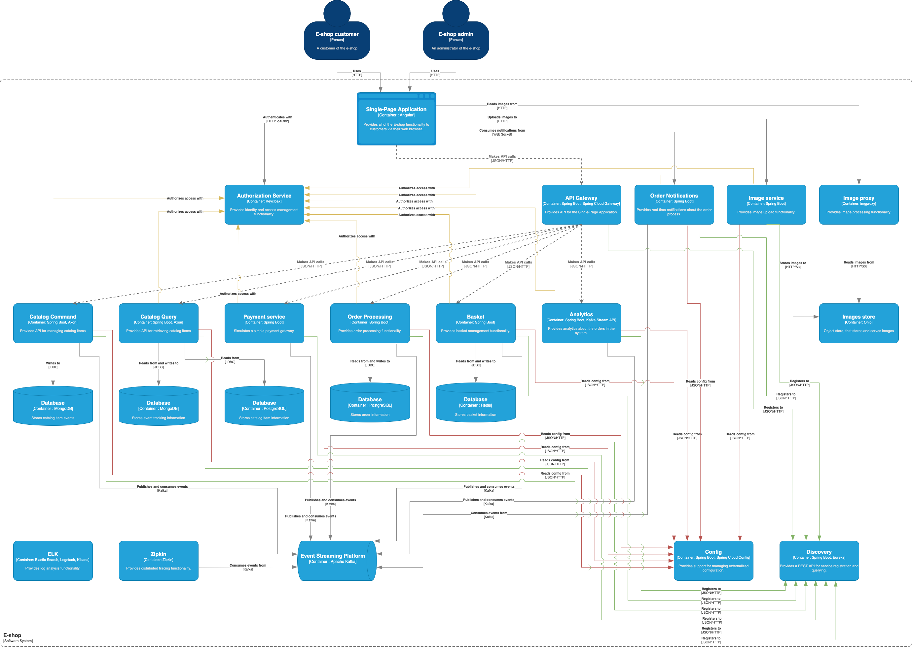
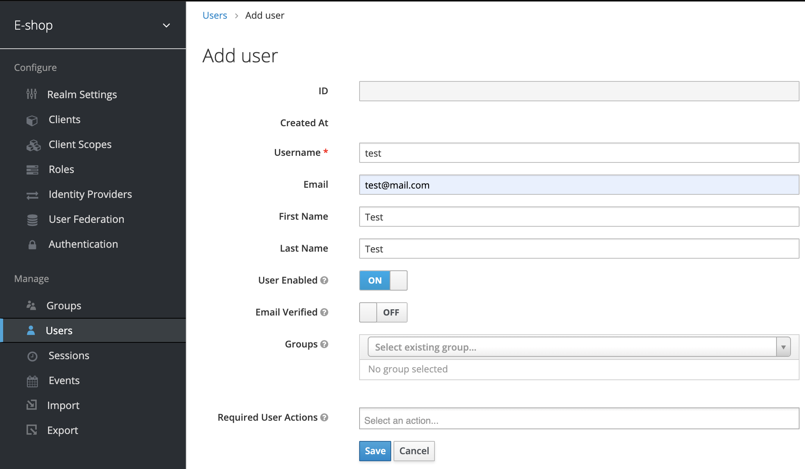
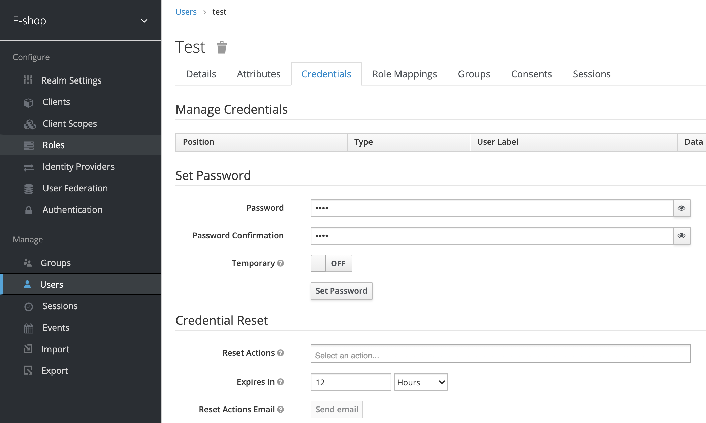
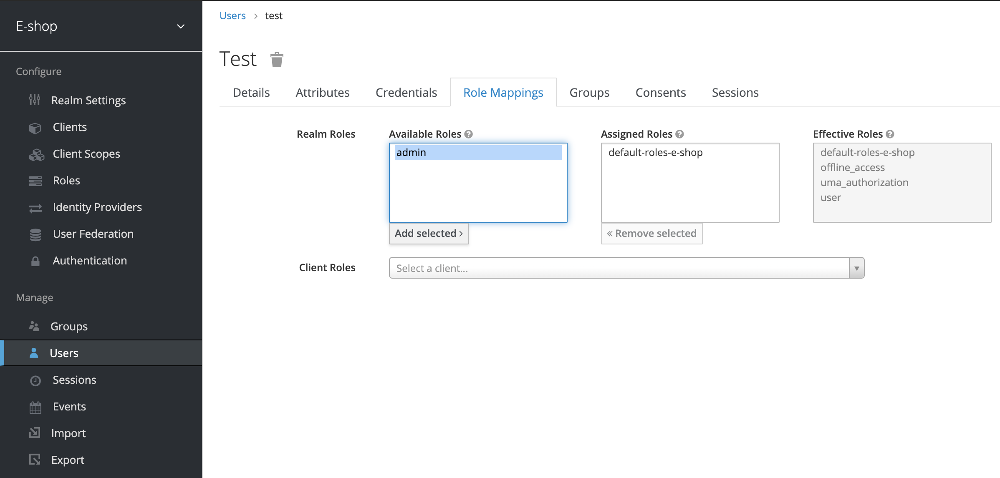

# e-shop

This project is inspired by `e-shop` that is inspired by `eShopOnContainers` and it's built to demonstrate features of [Spring Cloud](https://spring.io/projects/spring-cloud) for implementing microservices architecture.

In this project you can find examples of:

- Spring Cloud Config,
- Eureka Service Discovery,
- Spring Cloud Gateway,
- Spring Cloud Circuit Breaker,
- Resilience4j,
- Spring Cloud Sleuth,
- Spring Cloud Stream,
- Spring Kafka,
- Kafka Streams API,
- Keycloak,
- ...

## Architectural Diagram

Following you can see an architectural diagram



## Services

- [Config](infrastructure/config) - Centralized configuration service. You can access this service at
  http://localhost:8888. Credentials cfguser/cfgpassword.
- [Discovery](infrastructure/discovery) - Service registry that allows other services to find and communicate with each
  other. You can access this service at http://localhost:8761 and use admin/admin credentials.
- [API Gateway](infrastructure/gateway) - API Gateway. You can access the API Gateway at http://localhost:3000.
- [Catalog](services/catalog) - CQRS and Event Sourcing microservice, responsible for managing catalog items.
- [Basket](services/basket) - CRUD data-driven microservice that manages user basket.
- [Order Processing](services/order-processing) - Domain Driven Design (DDD) microservice, responsible for
  the order process.
- [Order Grace Period Task](services/order-grace-period-task) - Manages order grace period background task.
- [Order Notifications](services/order-notifications) - Notifies the user about the order status in real-time.
- [Payment](services/payment) - Simulates a simple payment gateway.
- [Analytics](services/analytics) - Real-time stream processing with Kafka Streams API.

## Build the services

First build the services with the following command:

```
./mvnw clean install
```

## Run the infrastructural and business services

Run all infrastructural and service containers using the following command:

```
docker-compose build
docker-compose up
```

### Run SPA client

The client application is implemented with angular.

```
cd client
npm install
npm start
```

You can access the client application at http://localhost:4200.

You can stop some services such as basket, order
processing, or analytics, and you will notice that you can still use the application without some of its features.

## Create user

Before you start using the application, you need to create a user.

You can access Keycloak authorization service at http://localhost:8090. Login with `admin`/`admin`, go to "Users", click "Add user" and fill in the necessary data.



After you save the user, go to "Credentials" to set a password.



If you want to assign admin role to the user, go to "Role Mappings", select "admin" under "Available Roles" and click "Add selected".



## References

- https://github.com/dotnet-architecture/eShopOnContainers

## Contributing

For a complete guide to contributing to the project, see the [Contribution Guide](CONTRIBUTING.md).

We welcome contributions of any kind including documentation, organization, tutorials, blog posts, bug reports, issues, feature requests, feature implementations, pull requests, answering questions on the forum, helping to manage issues, etc.

The project community and maintainers are very active and helpful, and the project benefits greatly from this activity.

### Reporting Issues

If you believe you have found a defect in the project or its documentation, use the repository issue tracker to report the problem to the project maintainers.

If you're not sure if it's a bug or not, start by asking in the discussion forum. When reporting the issue, please provide the version.

### Submitting Patches

The project welcomes all contributors and contributions regardless of skill or experience level.

If you are interested in helping with the project, we will help you with your contribution.

We want to create the best possible tool for our development teams and the best contribution experience for our developers, we have a set of guidelines which ensure that all contributions are acceptable.

The guidelines are not intended as a filter or barrier to participation. If you are unfamiliar with the contribution process, the team will help you and teach you how to bring your contribution in accordance with the guidelines.

For a complete guide to contributing, see the [Contribution Guide](CONTRIBUTING.md).

## Code of Conduct

See the [code-of-conduct.md](./code-of-conduct.md) file

## License

See the [LICENSE](./LICENSE) file
